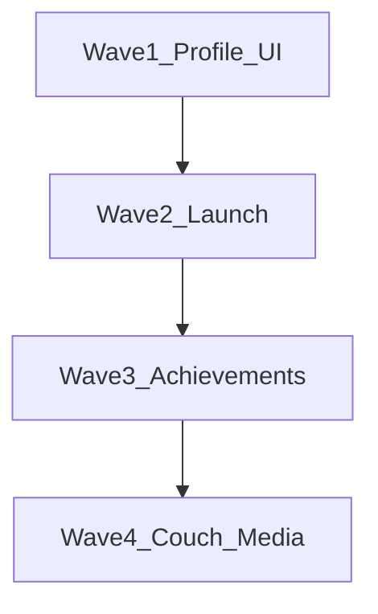

# Slifer Launcher feature roadmap

## Defaults (locked)

- **Wave order:** UI/profile → launch power → achievements → couch/media. Window-drag fix is immediate in wave 1.
- **Achievements:** Local unlock store first (definitions + unlock on local detect). Steam schema import where AppID exists; Epic/EA/Ubisoft as best-effort/stub adapters later — no cloud sync this pass.
- **Discord:** Keep Rich Presence (already in `src-tauri/src/discord.rs` + `useDiscordPresence`). Add a **local activity feed** on profile. True Discord friends-list / streaming alerts need OAuth + Discord API — out of wave 2 beyond presence polish.
- **Booster:** Soft mode (suspend known browser processes + minimize Slifer / lower priority) on `game-session-started`, restore on `game-session-ended` (`launch.rs` already emits both).

---

## Wave 1 — Profile and library UX (start here)

### 1. Setup window drag

`SetupPage` has no `data-tauri-drag-region`. Add a full-width top chrome bar (like `Header`) with drag region; keep interactive controls with `stopPropagation` on mousedown so language/buttons still click.

### 2. Country on profile

- Add `countryCode` to `UserProfile` (TS + Rust), `#[serde(default)]`.
- Detect once at setup/first launch via `Intl` / timezone heuristic; optional IP geo later; persist.
- Profile header: flag + country name beside status.
- Edit Profile: country dropdown (ISO list).

### 3. Badges tab shell

- Wire **Badges** tab on `ProfilePage` (remove toast stub).
- Grid of frosted empty tiles — no badge assets yet.

### 4. Custom game naming and manual sort

- DB/prefs: `displayName`, `sortIndex` on games via `GamePreferences` + SQLite migration.
- Rename in game context menu / detail.
- New library sort mode **Custom**; drag-and-drop reorder when Custom is active.
- Alphabetical rename still helps sequel grouping under Name sort.

---

## Wave 2 — Launch power ✅

### 5. Multiple launch profiles ✅

- Store `launchProfiles: { id, label, exePath?, args?, workingDir? }[]` + `defaultProfileId` per game.
- `GameActionBar`: PLAY split button + dropdown (Vanilla / Modded / VR…).
- `launch_game`: accept optional `profileId`; spawn with that exe/args.

### 6. Discord activity (pragmatic) ✅

- Already: playing/idle RPC on session start/end.
- Add: richer details (profile name, launch profile label); optional “Announce in activity” writing to a local **Activity** feed on profile.
- Friends-list posting needs Discord Social SDK / bot later.

### 7. Auto Game Booster ✅

- Settings toggle “Game Booster”.
- On `SESSION_STARTED`: suspend Chrome/Edge/Firefox (suspend only, not kill); set Slifer to low priority + optional minimize.
- On `SESSION_ENDED`: resume suspended PIDs + restore window/priority.
- Track suspended PIDs in memory for that session only.
- True separate headless helper exe is later; Wave 2 uses minimize + priority.

---

## Wave 3 — Local achievements ✅

### 8. Achievement system (local-first) ✅

- Schema: `achievement_defs` + `achievement_unlocks`.
- Steam: pull schema when `steamAppId` known; cache icons under AppData.
- Unlock v1: Steam local stats where readable; manual “mark unlocked” fallback; other stores stubbed.
- UI: ACHIEVEMENTS meta on action bar; game page panel; profile showcase later.
- Epic/EA/Ubi adapters follow — do not block Steam + manual path.

---

## Wave 4 — Couch and media ✅

### 9. Full gamepad navigation (Couch mode) ✅

- Settings toggle; full-screen simplified library shell.
- Focus ring + D-pad/A/B; Guide button global hotkey to show/hide Slifer (`gilrs` / GameInput in Rust).

### 10. Virtual mouse via controller ✅

- Right stick → cursor, triggers → click; when Couch mode or “Virtual mouse” enabled.

### 11. Screenshot and clip gallery ✅

- Hotkey default **F11** (configurable; Win+Alt+R optional preset).
- Save to `%APPDATA%/SliferLauncher/Media/{gameId}/`.
- Game page Media hub: stills first, short clips second.

---

## Out of scope / later

- Real Discord friends streaming alerts (OAuth).
- Full cross-store achievement parity.
- True tiny headless booster process (separate helper exe).

---

## Wave 1 build order

1. Setup drag region
2. Badges empty tab
3. Country detect + edit + display
4. `displayName` + `sortIndex` + Custom sort DnD

Then Wave 2 → 3 → 4.
